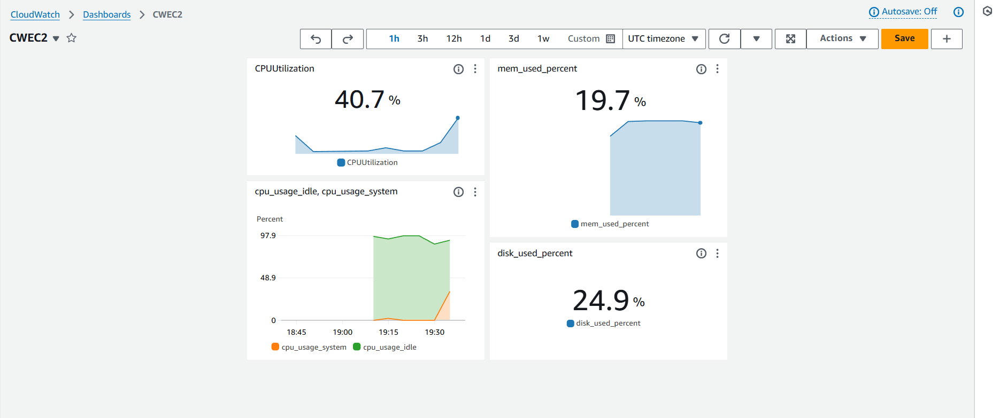

# Resumen de Video: Instalación y Configuración de CloudWatch Agent en EC2

## Introducción

Este video cubre cómo instalar y configurar el agente de CloudWatch en una instancia EC2 en AWS. El CloudWatch Agent se utiliza para monitorear actividades en la instancia, incluyendo utilización de CPU, memoria y almacenamiento.

## Pasos Principales

### 1. Crear un Rol en IAM para CloudWatch

1. En la consola de AWS, ve a IAM > Roles.
2. Crea un nuevo rol para EC2 seleccionando el tipo de entidad "EC2".
3. Añade las siguientes políticas al rol:
   - **AmazonEC2RoleforSSM**
   - **CloudWatchAgentServerPolicy**
4. Asigna un nombre al rol (ej., `CloudWatchAgentRole`) y créalo.

### 2. Crear e Iniciar una Instancia EC2

1. Ve a EC2 > Launch Instance.
2. Selecciona la Amazon Linux 2 AMI y el tipo de instancia (ej., `t2.micro`).
3. En "Configure Instance", selecciona el rol creado en el paso anterior.
4. Añade una regla de seguridad para HTTPS (puerto 443) para permitir la comunicación con CloudWatch.
5. Lanza la instancia y crea una nueva clave para conectarse.

### 3. Conectar y Configurar CloudWatch Agent en EC2

1. Conéctate a la instancia EC2 mediante SSH usando `ec2-user`.
2. Ejecuta el siguiente comando para instalar el CloudWatch Agent:

```bash
sudo yum install amazon-cloudwatch-agent
```

### 4. Configurar CloudWatch Agent mediante el Asistente

1. Navega al directorio del agente y ejecuta el asistente de configuración:

```bash
cd /opt/aws/amazon-cloudwatch-agent/bin
sudo ./amazon-cloudwatch-agent-config-wizard
```

2. Responde las preguntas del asistente:

- Sistema operativo: Linux
- Host: EC2
- Permitir StatsD: Sí
- Intervalo de colección: 10 segundos
- Monitoreo de CPU, memoria, disco, etc.

3. Finaliza el asistente y confirma la configuración.

### 5. Iniciar el CloudWatch Agent

Ve al directorio de instalación y utiliza el comando para iniciar el agente:

```bash
sudo ./amazon-cloudwatch-agent-ctl -a start
```

## Verificación y Monitoreo

### Métricas de CloudWatch

1. Ve a CloudWatch > Métricas > All Metrics.
2. Selecciona "Custom Namespaces" para ver métricas personalizadas generadas por el CloudWatch Agent, como CPU, disco, y memoria.

### Logs de CloudWatch

1. Ve a CloudWatch > Logs > Log Groups.
2. Encuentra el log group con el nombre configurado (ej., ec2 logs for cloudwatch agent instance).
3. Explora los logs del sistema en el log stream correspondiente.

### Dashboards
En base a las métricas se pueden generar dashboards para facilitar el entendimiento del rendimiento del EC2.



## Conclusión

Este proceso permite instalar y configurar el CloudWatch Agent en una instancia EC2, facilitando el monitoreo de métricas y la captura de logs del sistema en el dashboard de CloudWatch. Es una herramienta útil para gestionar y analizar la actividad de instancias en tiempo real.
